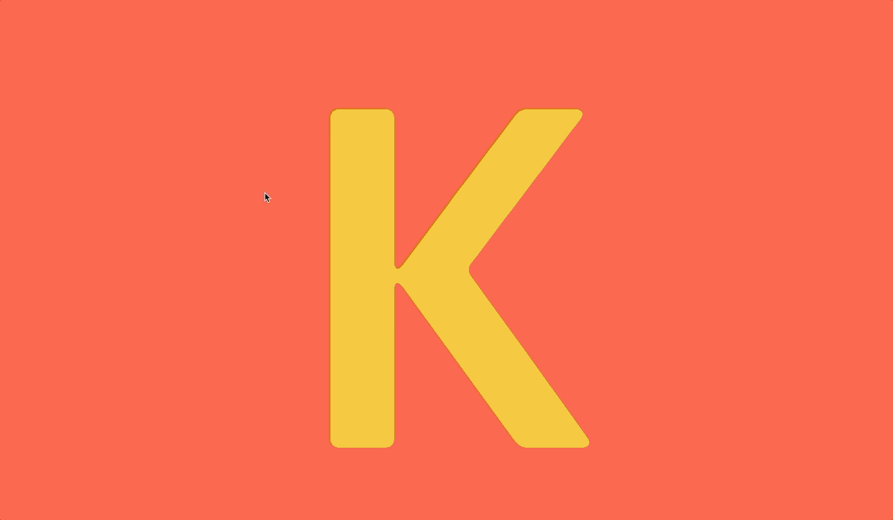
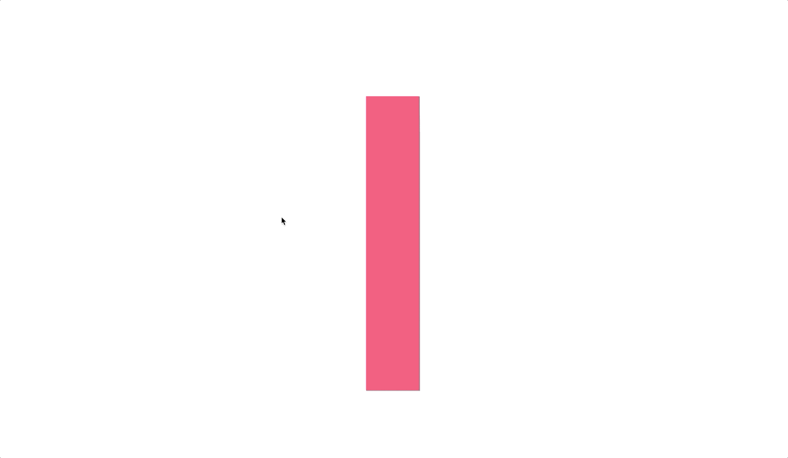
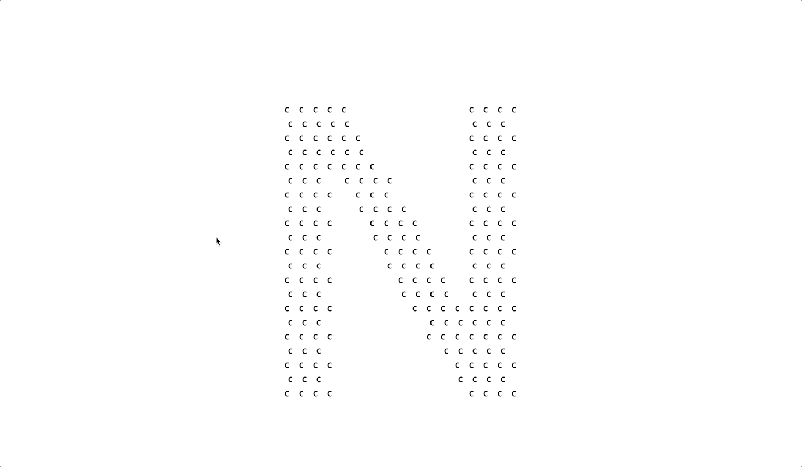
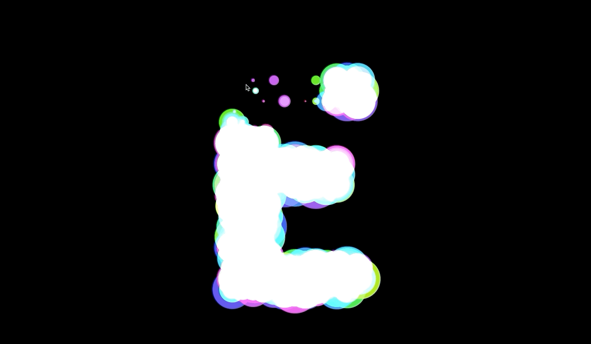
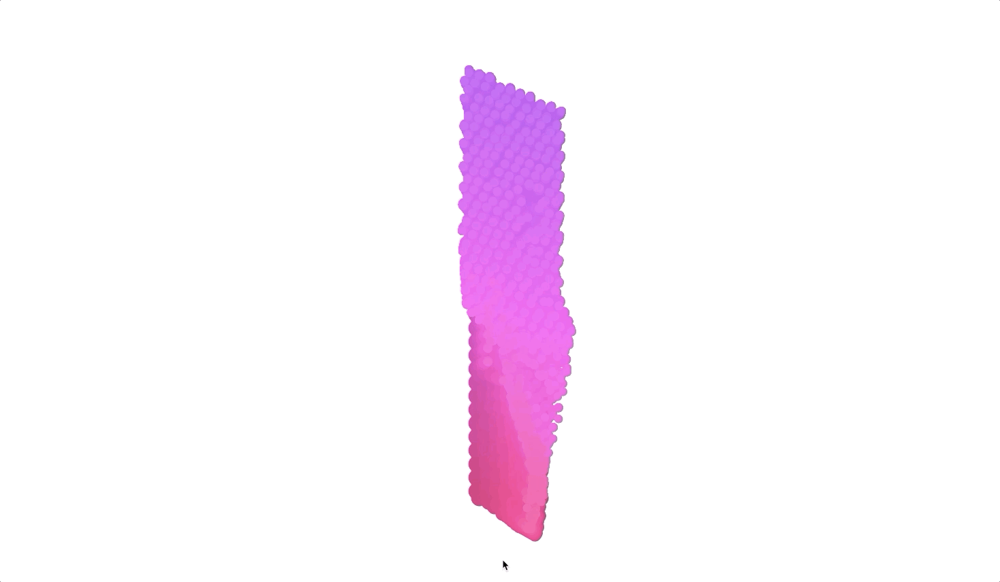
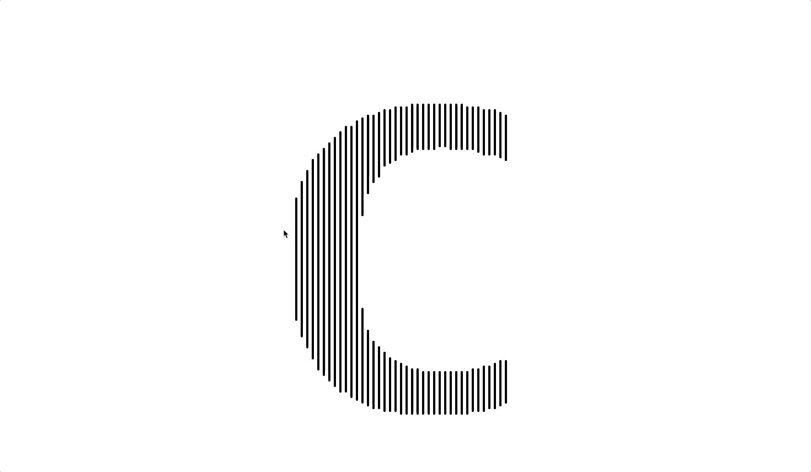

# Kinetic Typography

[Interactive Developer](https://www.youtube.com/channel/UCdeWxKJuvtUG2xyN6pOJEvA) 님의 유튜브 영상을 보면서 코드를 따라서 쳐보고, canvas와 pixi.js에 대해서 조금 공부해보았다. 코드는 cdn방식에서 npm esm 모듈 import 방식으로 변경하고, js를 ts로 변경해보았다.

original resource : https://www.youtube.com/watch?v=HMQ9fEX28fk

## result

| k1(pixi.js) : fluid         | k2(pixi.js) : particle      |
| --------------------------- | --------------------------- |
|  |  |
| k3 : destroy                | k4 : glow                   |
|  |  |
| k5 : thread                 | k6(pixi.js) : cloth         |
|  |  |
| k7 : string                 |                             |
|  |                             |

## how to use

### run all script

```bash
npm run start
```

### run each script

```bash
npm run k1
npm run k2
npm run k3
npm run k4
npm run k5
npm run k6
npm run k7
```

## review

-
